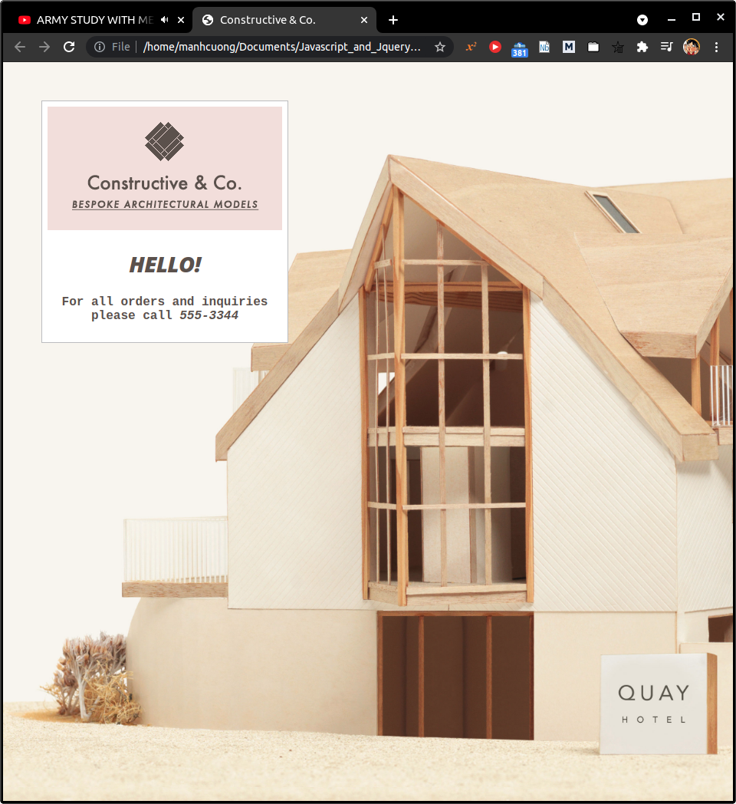

# 1. 1/a - What is a script and How do I create one?
# 2. 1/b - How do computers fit in with the world around them?
# 3. 1/c - How do I write a script for a web page?
## 3.1. How HTML, CSS and Javascript fit together?
## 3.2. Progressive enhancement
## 3.3. Creating a basic Javascript
* Xem `app_00`.
* Trước tiên, tạo thư mục có tên là `c01`, trong thư mục này tạo thư mục `js` vào bên trong `js` tạo file `add-content.js`.

    ```js
    var today = new Date();
    var hourNow = today.getHours();
    var greeting;

    if (hourNow > 18) {
        greeting = 'Good evening!';
    } else if (hourNow > 12) {
        greeting = 'Good afternoon!';
    } else if (hourNow > 0) {
        greeting = 'Good morning!';
    } else {
        greeting = 'Welcome!';
    }

    document.write('<h3>' + greeting + '</h3>');
    ```

## 3.4. Linking to a Javascript file form an HTML page
* Tao file `add-content.html` với nội dung sau:
    ```html
    <!DOCTYPE html>
    <html>
    <head>
        <title>Constructive &amp; Co.</title>
        <link rel="stylesheet" href="css/c01.css" />
    </head>
    <body>
        <h1>Constructive &amp; Co.</h1>
        <script src="js/add-content.js"></script>
        <p>For all orders and inquiries please call <em>555-3344</em></p>
    </body>
    </html>
    ```

* Bây giờ nếu mở file `add-content.html` thì sẽ thu được trang web dưới đây:
  

## 3.5. The source code is not amended
## 3.6. Placing the script in the page
* Xem `app_01`.
* Có thể đặt javascript code vào file `add-content.html` như sau:
    ```html
    <!DOCTYPE html>
    <html>
    <head>
        <title>Constructive &amp; Co.</title>
        <link rel="stylesheet" href="css/c01.css" />
    </head>
    <body>
        <h1>Constructive &amp; Co.</h1>
        <script>
            document.write("<h3>Hello!</h3>");
        </script>
        <p>For all orders and inquiries please call <em>555-3344</em></p>
    </body>
    </html>
    ```
  

## 3.7. How to use objects & methods
## 3.8. Javascript runs where it is found in the html
## 3.9. Summary