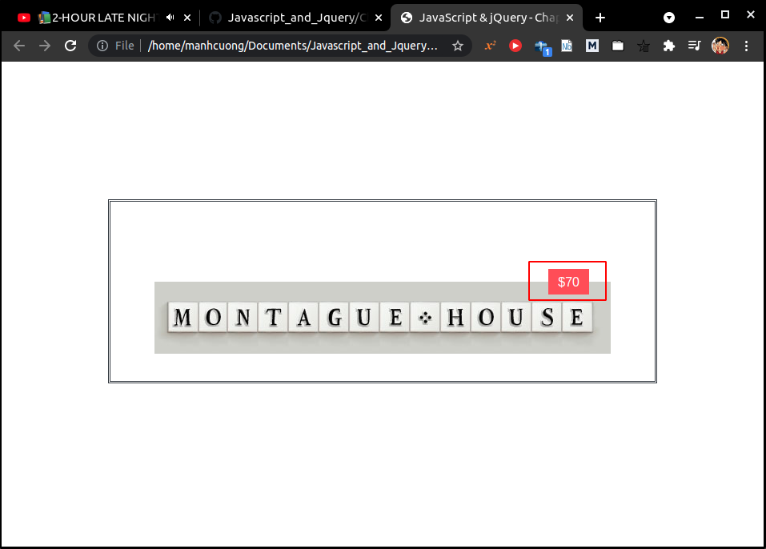
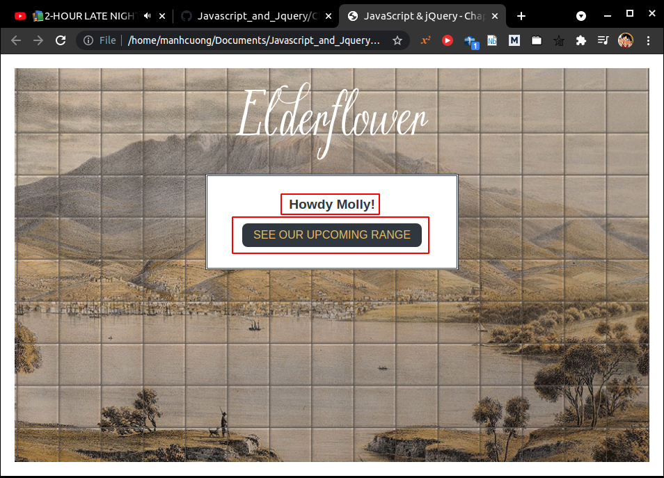
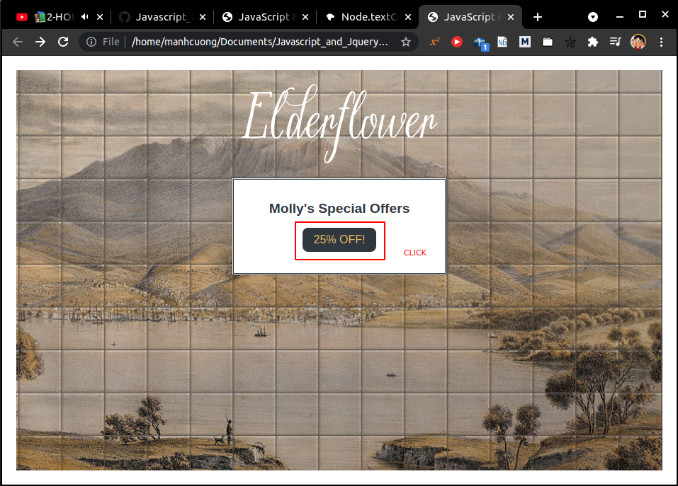
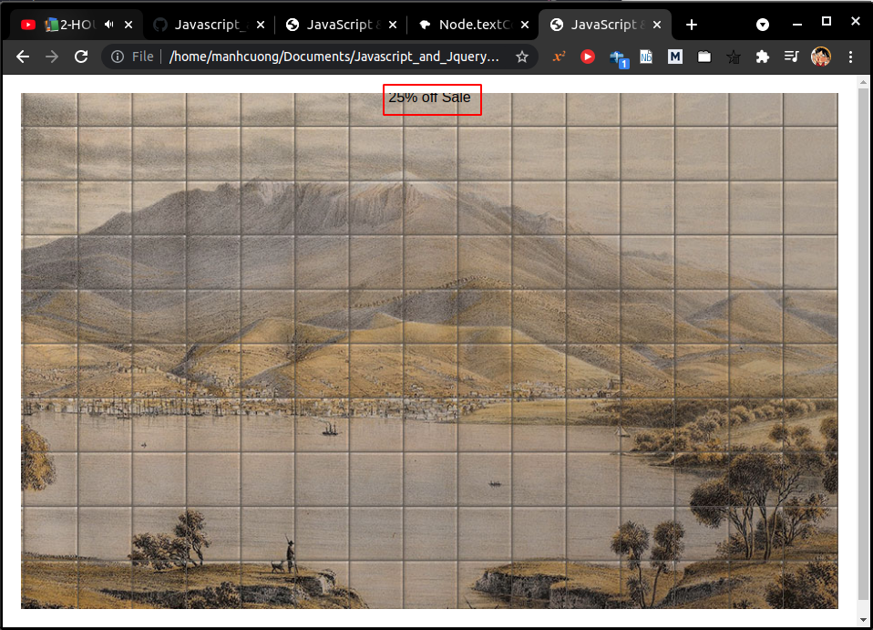

# 1. Statements

# 2. Comments

# 3. What is a variables?

# 4. Variables: How to declare them?

# 5. Variables: How to assign them a value?

# 6. Data types

# 7. Using a variable to store a number

- Xem `app_00`.

###### [app_00/c02/js/numeric-variable.js](app_00/c02/js/numeric-variable.js)

  ```js
  var price;
  var quantity;
  var total;

  price = 5;
  quantity = 14;
  total = price * quantity;

  var el = document.getElementById('cost');
  el.textContent = '$' + total;
  ```

###### [app_00/c02/numeric-variable.html](app_00/c02/numeric-variable.html)

  ```html
  <!DOCTYPE html>
  <html>
    <head>
      <title>
        JavaScript &amp; jQuery - Chapter 2: Basic JavaScript Instructions -
        Numeric Variable
      </title>
      <link rel="stylesheet" href="css/c02.css" />
    </head>
    <body>
      <h1>Elderflower</h1>
      <div id="content">
        <h2>Custom Signage</h2>
        <div id="cost">Cost: $5 per tile</div>
        
      </div>
      <script src="js/numeric-variable.js"></script>
    </body>
  </html>
  ```



# 8. Using a variable to stroe a string
* Xem `app_01`.

###### [app_01/c02/js/string-variable.js](app_01/c02/js/string-variable.js)
  ```js
  var username;
  var message;

  username = 'Molly';
  message = 'See our upcoming range';

  var elName = document.getElementById('name');
  elName.textContent = username;

  var elNote = document.getElementById('note');
  elNote.textContent = message;
  ```

###### [app_01/c02/string-variable.html](app_01/c02/string-variable.html)
  ```html
  <!DOCTYPE html>
  <html>
    <head>
      <title>JavaScript &amp; jQuery - Chapter 2: Basic JavaScript Instructions - String Variable</title>
      <link rel="stylesheet" href="css/c02.css" />
    </head>
    <body>
      <h1>Elderflower</h1>
      <div id="content">
        <div id="title">Howdy <span id="name">friend</span>!</div>
        <div id="note">Take a look around...</div>
      </div>
      <script src="js/string-variable.js"></script>
    </body>
  </html>
  ```

  

# 9. Using quotes inside a string
* Xem `app_02`.

###### [app_02/c02/js/string-with-quotes.js](app_02/c02/js/string-with-quotes.js)
```js
var title; 
var message;

title = "Molly's Special Offers";
message = '<a href=\"sale.html\">25% off!</a>';

var elTitle = document.getElementById('title');
elTitle.textContent = title;

var elNote = document.getElementById('note');
elNote.innerHTML = message;
```

###### [app_02/c02/string-with-quotes.html](app_02/c02/string-with-quotes.html)
  ```html
  <!DOCTYPE html>
  <html>
    <head>
      <title>JavaScript &amp; jQuery - Chapter 2: Basic JavaScript Instructions - String With Quotes</title>
      <link rel="stylesheet" href="css/c02.css" />
    </head>
    <body>
      <h1>Elderflower</h1>
      <div id="content">
        <div id="title">Special Offers</div>
        <div id="note">Sign-up to receive personalized offers!</div>
      </div>
      <script src="js/string-with-quotes.js"></script>
    </body>
  </html>
  ```

###### [app_02/c02/sale.html](app_02/c02/sale.html)
  ```html
  <!DOCTYPE html>
  <html>
  <head>
    <title>JavaScript &amp; jQuery - Chapter 2: Basic JavaScript Instructions - Sale</title>
    <link rel="stylesheet" href="css/c02.css" />
  </head>
  <body>
    <p>25% off Sale</p>
  </body>
  </html>
  ```

* Chạy file `app_02/c02/string-with-quotes.html`:
  
  