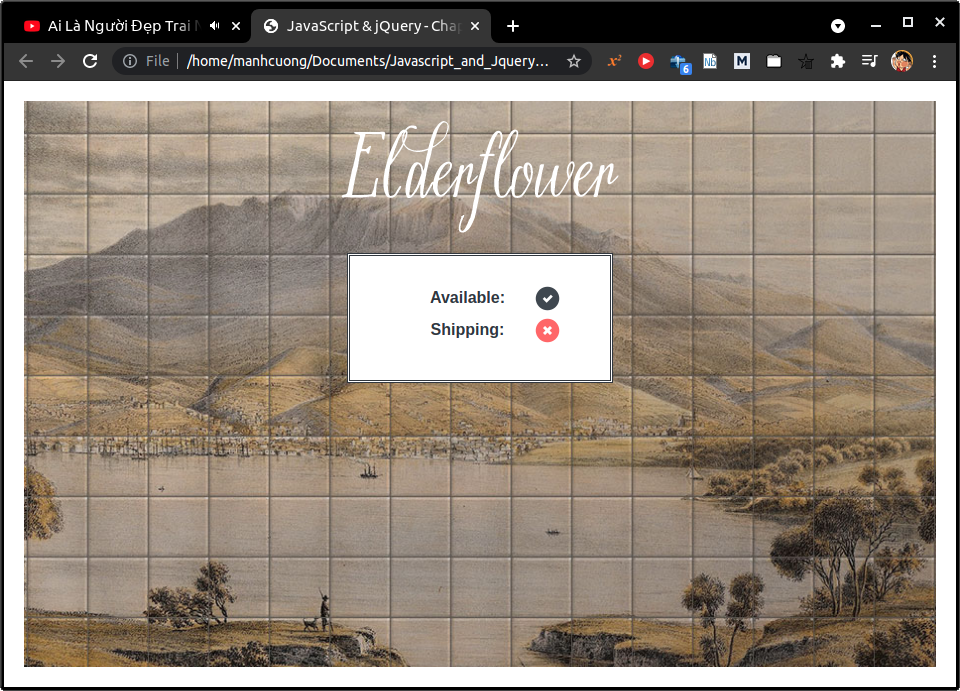
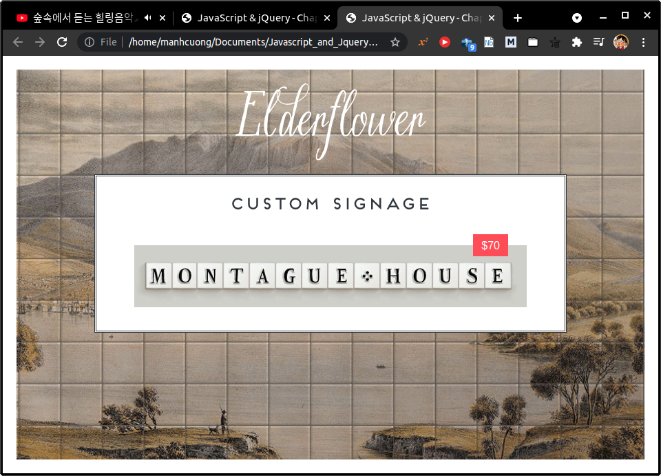
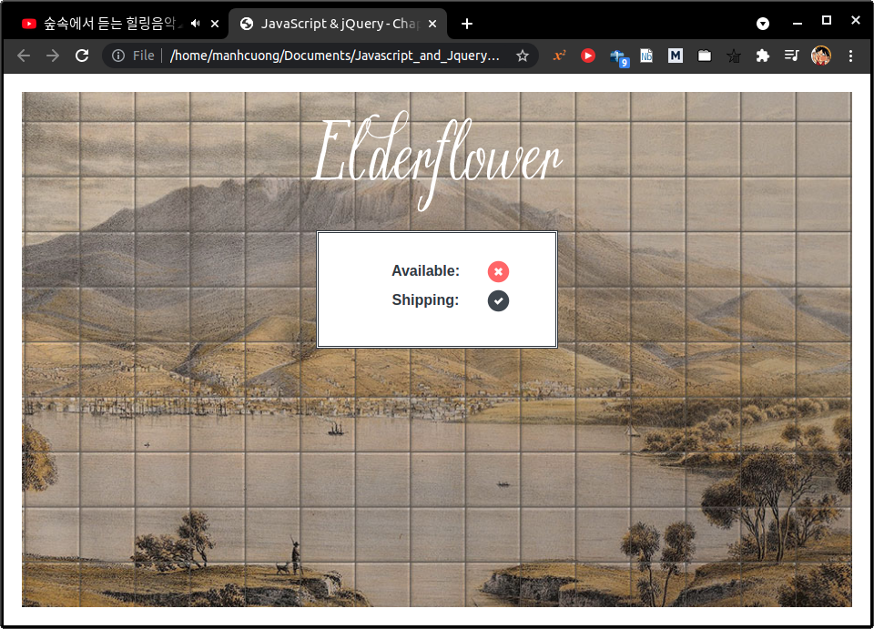
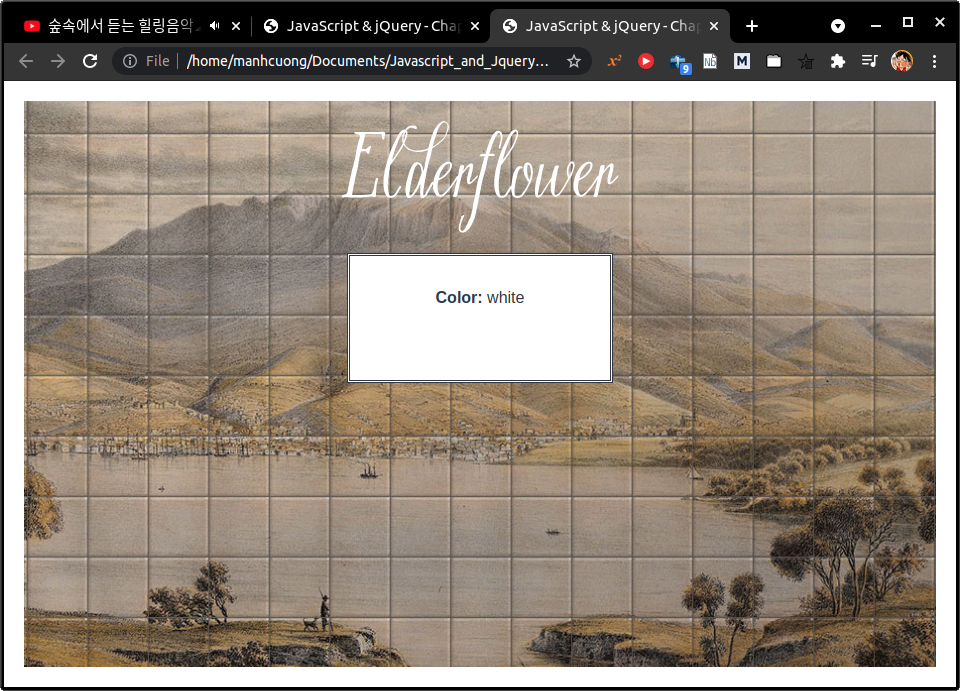
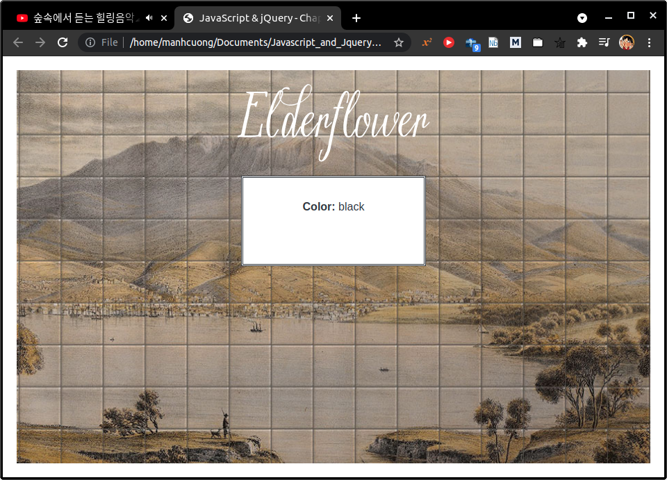

# 1. Statements

# 2. Comments

# 3. What is a variables?

# 4. Variables: How to declare them?

# 5. Variables: How to assign them a value?

# 6. Data types

# 7. Using a variable to store a number

- Xem `app_00`.

###### [app_00/c02/js/numeric-variable.js](app_00/c02/js/numeric-variable.js)

  ```js
  var price;
  var quantity;
  var total;

  price = 5;
  quantity = 14;
  total = price * quantity;

  var el = document.getElementById('cost');
  el.textContent = '$' + total;
  ```

###### [app_00/c02/numeric-variable.html](app_00/c02/numeric-variable.html)

  ```html
  <!DOCTYPE html>
  <html>
    <head>
      <title>
        JavaScript &amp; jQuery - Chapter 2: Basic JavaScript Instructions -
        Numeric Variable
      </title>
      <link rel="stylesheet" href="css/c02.css" />
    </head>
    <body>
      <h1>Elderflower</h1>
      <div id="content">
        <h2>Custom Signage</h2>
        <div id="cost">Cost: $5 per tile</div>
        
      </div>
      <script src="js/numeric-variable.js"></script>
    </body>
  </html>
  ```


# 8. Using a variable to stroe a string
* Xem `app_01`.

###### [app_01/c02/js/string-variable.js](app_01/c02/js/string-variable.js)
  ```js
  var username;
  var message;

  username = 'Molly';
  message = 'See our upcoming range';

  var elName = document.getElementById('name');
  elName.textContent = username;

  var elNote = document.getElementById('note');
  elNote.textContent = message;
  ```

###### [app_01/c02/string-variable.html](app_01/c02/string-variable.html)
  ```html
  <!DOCTYPE html>
  <html>
    <head>
      <title>JavaScript &amp; jQuery - Chapter 2: Basic JavaScript Instructions - String Variable</title>
      <link rel="stylesheet" href="css/c02.css" />
    </head>
    <body>
      <h1>Elderflower</h1>
      <div id="content">
        <div id="title">Howdy <span id="name">friend</span>!</div>
        <div id="note">Take a look around...</div>
      </div>
      <script src="js/string-variable.js"></script>
    </body>
  </html>
  ```

  

# 9. Using quotes inside a string
* Xem `app_02`.

###### [app_02/c02/js/string-with-quotes.js](app_02/c02/js/string-with-quotes.js)
```js
var title; 
var message;

title = "Molly's Special Offers";
message = '<a href=\"sale.html\">25% off!</a>';

var elTitle = document.getElementById('title');
elTitle.textContent = title;

var elNote = document.getElementById('note');
elNote.innerHTML = message;
```

###### [app_02/c02/string-with-quotes.html](app_02/c02/string-with-quotes.html)
  ```html
  <!DOCTYPE html>
  <html>
    <head>
      <title>JavaScript &amp; jQuery - Chapter 2: Basic JavaScript Instructions - String With Quotes</title>
      <link rel="stylesheet" href="css/c02.css" />
    </head>
    <body>
      <h1>Elderflower</h1>
      <div id="content">
        <div id="title">Special Offers</div>
        <div id="note">Sign-up to receive personalized offers!</div>
      </div>
      <script src="js/string-with-quotes.js"></script>
    </body>
  </html>
  ```

###### [app_02/c02/sale.html](app_02/c02/sale.html)
  ```html
  <!DOCTYPE html>
  <html>
  <head>
    <title>JavaScript &amp; jQuery - Chapter 2: Basic JavaScript Instructions - Sale</title>
    <link rel="stylesheet" href="css/c02.css" />
  </head>
  <body>
    <p>25% off Sale</p>
  </body>
  </html>
  ```

* Chạy file `app_02/c02/string-with-quotes.html`:
  
  

# 10. Using a variable to store a boolean
* Xem `app_03`.

###### [app_03/c02/js/boolean-variable.js](app_03/c02/js/boolean-variable.js)
  ```js
  var inStock;
  var shipping;
  inStock = true;
  shipping = false;

  var elStock = document.getElementById('stock');
  elStock.className = inStock;

  var elShip = document.getElementById('shipping');
  elShip.className = shipping;
  ```

###### [app_03/c02/boolean-variable.html](app_03/c02/boolean-variable.html)
  ```html
  <!DOCTYPE html>
  <html>
    <head>
      <title>JavaScript &amp; jQuery - Chapter 2: Basic JavaScript Instructions - Boolean Variable</title>
      <link rel="stylesheet" href="css/c02.css" />
    </head>
    <body>
      <h1>Elderflower</h1>
      <div id="content">
        <div class="message">Available: <span id="stock"></span></div>
        <div class="message">Shipping: <span id="shipping"></span></div>
      </div>
      <script src="js/boolean-variable.js"></script>
    </body>
  </html>
  ```

  

# 11. Shorthand for creating variables
* Xem `app_04`.
###### [app_04/c02/js/shorthand-variable.js](app_04/c02/js/shorthand-variable.js)
  ```js
  // METHOD 1
  var price = 5;
  var quantity = 14;
  var total = price * quantity;

  /* METHOD 2
  var price, quantity, total;
  price = 5;
  quantity = 14;
  total = price * quantity;
  */

  /* METHOD 3
  var price = 5, quantity = 14;
  var total = price * quantity;
  */

  var el = document.getElementById('cost'); 
  el.textContent = '$' + total;              
  ```

###### [app_04/c02/shorthand-variable.html](app_04/c02/shorthand-variable.html)
  ```html
  <!DOCTYPE html>
  <html>
    <head>
      <title>JavaScript &amp; jQuery - Chapter 2: Basic JavaScript Instructions - Shorthand Variable</title>
      <link rel="stylesheet" href="css/c02.css" />
    </head>
    <body>
      <h1>Elderflower</h1>
      <div id="content">
        <h2>Custom Signage</h2>
        <div id="cost">Cost: $5 per tile</div>
        
      </div>
      <script src="js/shorthand-variable.js"></script>
    </body>
  </html>
  ```
  

# 12. Changing the value of a variable
* Xem `app_05`.

###### [app_05/c02/js/update-variable.js](app_05/c02/js/update-variable.js)
  ```js
  var inStock;
  var shipping;

  inStock = true;
  shipping = false;

  inStock = false;
  shipping = true;

  var elStock = document.getElementById('stock');
  elStock.className = inStock;

  var elShip = document.getElementById('shipping');
  elShip.className = shipping;
  ```

###### [app_05/c02/update-variable.html](app_05/c02/update-variable.html)
  ```html
  <!DOCTYPE html>
  <html>
    <head>
      <title>JavaScript &amp; jQuery - Chapter 2: Basic JavaScript Instructions - Update Variable</title>
      <link rel="stylesheet" href="css/c02.css" />
    </head>
    <body>
      <h1>Elderflower</h1>
      <div id="content">
        <div class="message">Available: <span id="stock"></span></div>
        <div class="message">Shipping: <span id="shipping"></span></div>
      </div>
      <script src="js/update-variable.js"></script>
    </body>
  </html>
  ```
  

# 13. Rules for naming variables
# 14. Arrays
# 15. Creating an array
* Xem `app_06`.

###### [app_06/c02/js/array-literal.js](app_06/c02/js/array-literal.js)
  ```js
  var colors; 
  colors = ['white', 'black', 'custom'];

  var el = document.getElementById('colors');
  el.textContent = colors[0];
  ```
###### [app_06/c02/array-literal.html](app_06/c02/array-literal.html)
  ```html
  <!DOCTYPE html>
  <html>
  <head>
    <title>JavaScript &amp; jQuery - Chapter 2: Basic JavaScript Instructions - Array Literal</title>
    <link rel="stylesheet" href="css/c02.css" />
  </head>
  <body>
    <h1>Elderflower</h1>
    <div id="content">
        <div class="message">Color: <span id="colors">We were unable to find your color choice. Please try again...</span></div>
    </div>
    <script src="js/array-literal.js"></script>
  </body>
  </html>
  ```
  

<hr>

* Xem folder `app_07`.

###### [app_07/c02/js/array-constructor.js](app_07/c02/js/array-constructor.js)
  ```js
  var colors = new Array('white', 
                        'black',
                        'custom');

  var el = document.getElementById('colors');
  el.textContent = colors[1];
  ```

###### [app_07/c02/array-constructor.html](app_07/c02/array-constructor.html)
  ```html
  <!DOCTYPE html>
  <html>
  <head>
    <title>JavaScript &amp; jQuery - Chapter 2: Basic JavaScript Instructions - Array Constructor</title>
    <link rel="stylesheet" href="css/c02.css" />
  </head>
  <body>
    <h1>Elderflower</h1>
    <div id="content">
        <div class="message">Color: <span id="colors">We were unable to find your color choice. Please try again...</span></div>
    </div>
    <script src="js/array-constructor.js"></script>
  </body>
  </html>
  ```
  

# 16. Values in arrays
