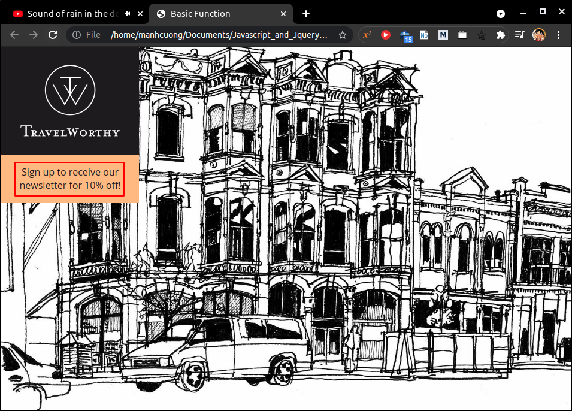
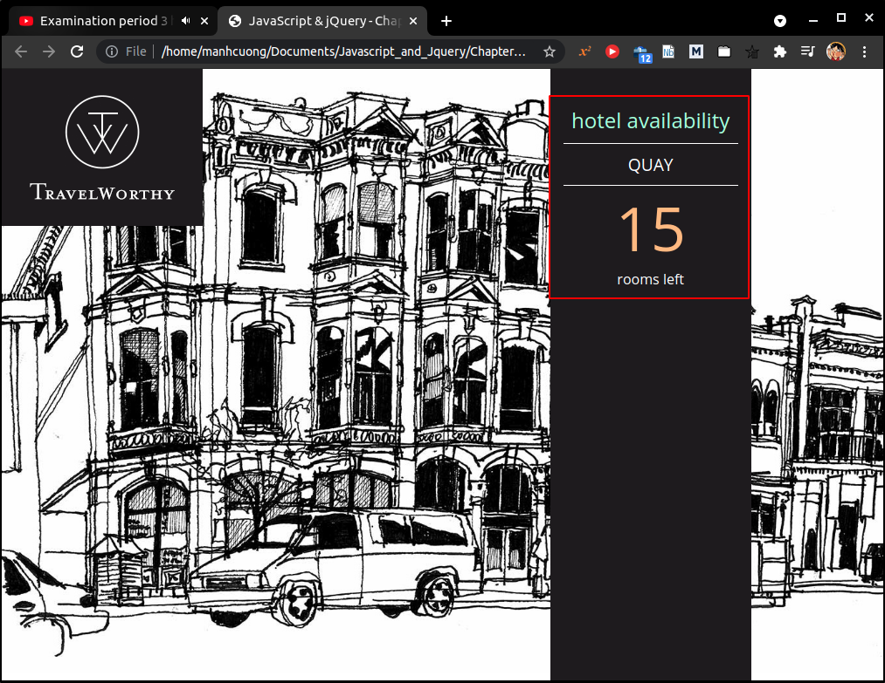
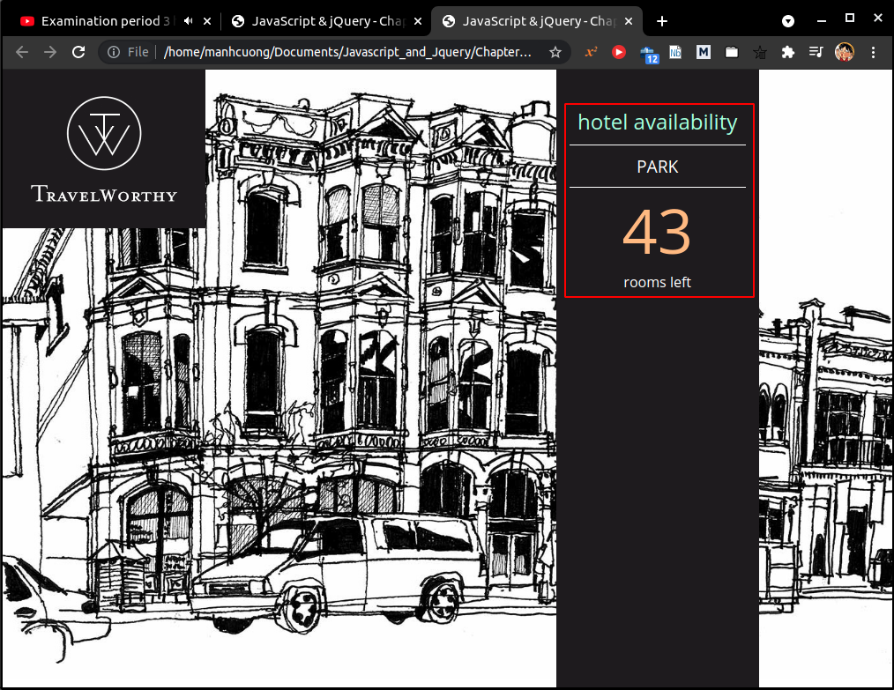
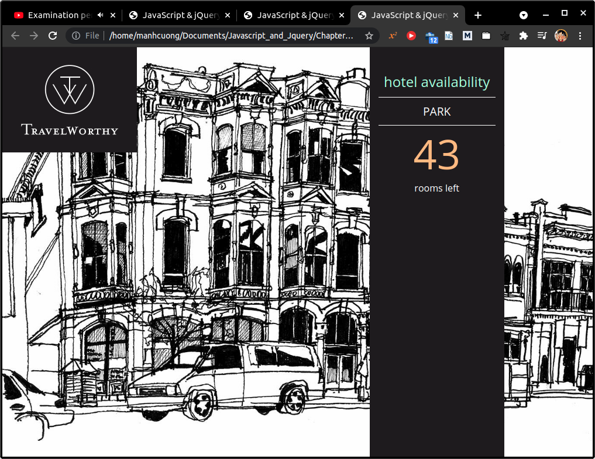
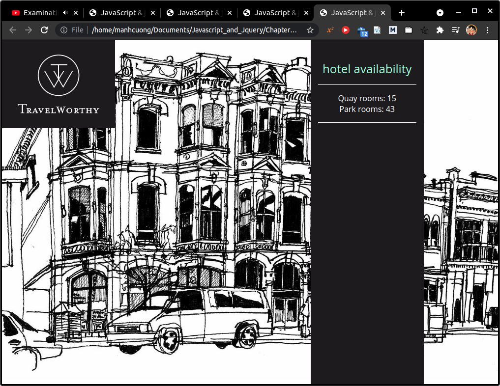
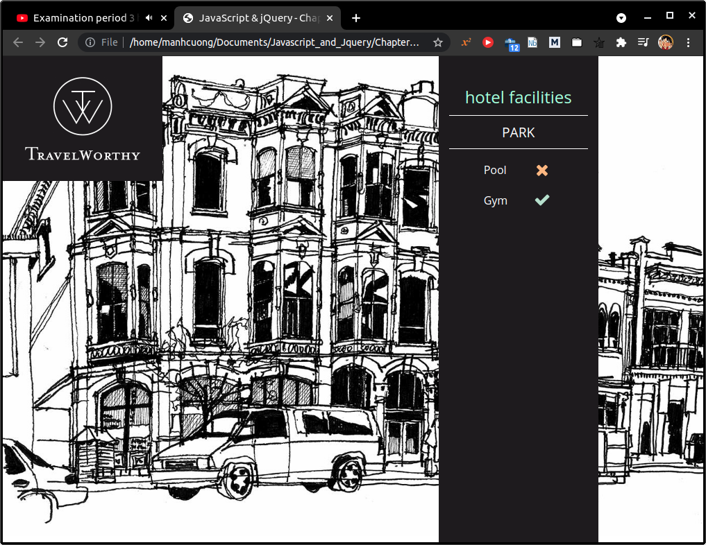

# 1. What is a function?

# 2. A basic function

- Xem `app_00`.

###### [app_00/c03/js/basic-function.js](app_00/c03/js/basic-function.js)

```js
var msg = "Sign up to receive our newsletter for 10% off!";

function updateMessage() {
    var el = document.getElementById("message");
    el.textContent = msg;
}

updateMessage();
```

###### [app_00/c03/basic-function.html](app_00/c03/basic-function.html)

```html
<!DOCTYPE html>
<html>
  <head>
    <title>Basic Function</title>
    <link rel="stylesheet" href="css/c03.css" />
  </head>
  <body>
    <h1>TravelWorthy</h1>
    <div id="message">Welcome to our site!</div>
    <script src="js/basic-function.js"></script>
  </body>
</html>
```


# 3. Declaring a function
```js
function sayHello() {
    document.write("Hello!");
}
```
# 4. Calling a function
```js
sayHello();
```
# 5. Declaring a functions that need information
```js
function getArea(width, height) {
    return width * height;
}
```
# 6. Calling functions that need information
```js
wallWidth = 3;
wallHeight = 5;
getArea(wallWidth, wallHeight);
```
# 7. Getting a single value out of a function
```js
function calculateArea(width, height) {
    var area = width * height
    return area;
}

var wallOne = calculateArea(3, 5);
var wallTwo = calculateArea(8, 5);
```
# 8. Getting multiple values out of a function
```js
function getSize(width, height, depth) {
    var area = width * height;
    var volume = width * height * depth;
    var sizes = [area, volume];

    return sizes;
}

var areaOne = getSize(3, 2, 3)[0];
var volumeOne = getSize(3, 2, 3)[1];
```

# 9. Anonymous functions & function expressions
* Trong Js, các biến và function declaration sẽ dc trình biên dịch tìm kiếm và chạy trc sau đó mới chạy các dòng code thực thi chính, điều này có nghĩa là các `function declaration` sẽ dc khởi tạo ngay trc cả khi nó thực sự dc gọi đến.
* Bên cạnh đó một hàm khác được gọi là `function expression`, các hàm này, loại hàm này sẽ ko dc trình biên dịch tìm kiếm và chạy trc, chỉ khi nào trong các dòng code thực thi cần đến những hàm này thì chúng mới được khởi tạo.

* Function declaration
```js
function area(width, height) {
    return width * height;
}

var size = area(3, 4);
```

* Function expression
```js
var area = function(width, height) {
    return width * height;
}

var size = area(3, 4);
```

# 10. Immediately invoked function expressions
* Immediately invoked function expressions (IIFE) hay còn được hiểu là thực thi function expressions ngay lập tức. Các hàm này sẽ dc thực thi ngay lập tức nếu trình biên dịch bắt gặp chúng.
* Ngoài ra, các biến trong IIFE là private, có nghĩa là nếu bên ngoài hàm này có biến cùng tên với các biến bên trong hàm thì cũng ko sao.

```js
var area = (function() {
    var width = 3;
    var height = 2;
    retuen width * height;
}());
```

# 11. Variable scope
# 12. How memory & variables work
# 13. What is an object?
```js
var hotel = {
    name = "Quay",
    rooms: 40,
    booked: 25,
    gym: true,
    roomTypes: ['twin', 'double', 'suite'],

    checkAvailability: function() {
        return this.rooms - this.booked;
    }
}
```

# 14. Creating an object: literal notation
# 15. Accessing an object and dot notation
```js
var hotelName = hotel.name;
var roomsFree = hotel.checkAvailability();

var hotelName2 = hotel['name'];
```

# 16. Creating object using literal notation
* Xem `app_01`.

###### [app_01/c03/js/object-literal.js](app_01/c03/js/object-literal.js)
```js
var hotel = {
  name : 'Quay',
  rooms : 40,
  booked : 25,
  checkAvailability : function() {
    return this.rooms - this.booked;
  }
};


var elName = document.getElementById('hotelName');
elName.textContent = hotel.name; 

var elRooms = document.getElementById('rooms');
elRooms.textContent = hotel.checkAvailability();
```

###### [app_01/c03/object-literal.html](app_01/c03/object-literal.html)
```html
<!DOCTYPE html>
<html>
  <head>
    <title>JavaScript &amp; jQuery - Chapter 3: Functions, Methods &amp; Objects - Object Literal</title>
    <link rel="stylesheet" href="css/c03.css" />
  </head>
  <body>
    <h1>TravelWorthy</h1>
    <div id="info">
      <h2>hotel availability</h2>
      <div id="hotelName"></div>
      <div id="availability">
        <p id="rooms"></p>
        <p>rooms left</p>
      </div>
    </div>
    <script src="js/object-literal.js"></script>
  </body>
</html>
```


# 17. Creating more object literals
* Xem `app_021.
###### [app_02/c03/js/object-literal2.js](app_02/c03/js/object-literal2.js)
```js
var hotel = {
  name : 'Park',
  rooms : 120,
  booked : 77,
  checkAvailability : function() {
    return this.rooms - this.booked; 
  }
};


var elName = document.getElementById('hotelName'); 
elName.textContent = hotel.name;                   

var elRooms = document.getElementById('rooms');    
elRooms.textContent = hotel.checkAvailability();  
```

###### [app_02/c03/object-literal2.html](app_02/c03/object-literal2.html)
```html
<!DOCTYPE html>
<html>
  <head>
    <title>JavaScript &amp; jQuery - Chapter 3: Functions, Methods &amp; Objects - Object Literal 2</title>
    <link rel="stylesheet" href="css/c03.css" />
  </head>
  <body>
    <h1>TravelWorthy</h1>
    <div id="info">
      <h2>hotel availability</h2>
      <div id="hotelName"></div>
      <div id="availability">
        <p id="rooms"></p>
        <p>rooms left</p>
      </div>
    </div>
    <script src="js/object-literal2.js"></script>
  </body>
</html>
```


# 18. Creating an object: constructor notation
```js
var hotel = new Object();
hotel.name = 'Quay';
hotel.rooms = 40;
hotel.booked = 25;

hotel.checkAvailability = function() {
    return this.rooms - this.booked;
}
```

# 19. Update an object
```js
hotel.name = 'Park';
// or
hotel['name'] = 'Park'
```

* Delete một property
```js
delete hotel.name
```

# 20. Creating many objects: constructor notation
```js
function Hotel(name, room, booked) {
    this.name = name;
    this.room = room;
    this.booked = booked;

    this.checkAvailability = function() {
        return this.rooms - this.booked;
    }
}

var quayHotel = new Hotel('Quay', 40, 25);
var parkHotel = new Hotel('Park', 120, 77);
```

# 21. Creating object using constructors syntax
* Xem `app_03`.

###### [app_03/c03/js/object-constructor.js](app_03/c03/js/object-constructor.js)
```js
var hotel = new Object();

hotel.name = 'Park';
hotel.rooms = 120;
hotel.booked = 77;
hotel.checkAvailability = function() {
  return this.rooms - this.booked;  
};


var elName = document.getElementById('hotelName'); 
elName.textContent = hotel.name;     

var elRooms = document.getElementById('rooms');   
elRooms.textContent = hotel.checkAvailability();  
```

###### [app_03/c03/object-constructor.html](app_03/c03/object-constructor.html)
```html
<!DOCTYPE html>
<html>
  <head>
    <title>JavaScript &amp; jQuery - Chapter 3: Functions, Methods &amp; Objects - Object Constructor</title>
    <link rel="stylesheet" href="css/c03.css" />
  </head>
  <body>
    <h1>TravelWorthy</h1>
    <div id="info">
      <h2>hotel availability</h2>
      <div id="hotelName"></div>
      <div id="availability">
        <p id="rooms"></p>
        <p>rooms left</p>
      </div>
    </div>
    <script src="js/object-constructor.js"></script>
  </body>
</html>
```


# 22. Create & access objects constructor notation
* Xem `app_04`.

###### [app_04/c03/js/multiple-objects.js](app_04/c03/js/multiple-objects.js)
```js
function Hotel(name, rooms, booked) {
  this.name = name;
  this.rooms = rooms;
  this.booked = booked;
  this.checkAvailability = function() {
    return this.rooms - this.booked;
  };
}


var quayHotel = new Hotel('Quay', 40, 25);
var parkHotel = new Hotel('Park', 120, 77);


var details1 = quayHotel.name + ' rooms: ';
    details1 += quayHotel.checkAvailability();
var elHotel1 = document.getElementById('hotel1');
elHotel1.textContent = details1;

var details2 = parkHotel.name + ' rooms: ';
    details2 += parkHotel.checkAvailability();
var elHotel2 = document.getElementById('hotel2');
elHotel2.textContent = details2;
```

###### [app_04/c03/multiple-objects.html](app_04/c03/multiple-objects.html)
```html
<!DOCTYPE html>
<html>
  <head>
    <title>JavaScript &amp; jQuery - Chapter 3: Functions, Methods &amp; Objects - Object Constructor</title>
    <link rel="stylesheet" href="css/c03.css" />
  </head>
  <body>
    <h1>TravelWorthy</h1>
    <div id="info">
      <h2>hotel availability</h2>
      <div id="hotel1"></div>
      <div id="hotel2"></div>
    </div>
    <script src="js/multiple-objects.js"></script>
  </body>
</html>
```


# 23. Adding and removing properties
* Xem `app_05`.

###### [app_05/c03/js/adding-and-removing-properties.js](app_05/c03/js/adding-and-removing-properties.js)
```js
// Set up the object
var hotel = {
  name : 'Park',
  rooms : 120,
  booked : 77
};

hotel.gym = true;
hotel.pool = false;
delete hotel.booked;

var elName = document.getElementById('hotelName'); 
elName.textContent = hotel.name;                  

var elPool = document.getElementById('pool');     
elPool.className = hotel.pool;                   

var elGym = document.getElementById('gym');    
elGym.className = hotel.gym;                     
```

###### [app_05/c03/adding-and-removing-properties.html](app_05/c03/adding-and-removing-properties.html)
```html
<!DOCTYPE html>
<html>
  <head>
    <title>JavaScript &amp; jQuery - Chapter 3: Functions, Methods &amp; Objects - Adding properties</title>
    <link rel="stylesheet" href="css/c03.css" />
  </head>
  <body>
    <h1>TravelWorthy</h1>
    <div id="info">
      <h2>hotel facilities</h2>
      <div id="hotelName"></div>
      <div>
        <p id="pool">Pool</p>
        <p id="gym">Gym</p>
      </div>
    </div>
    <script src="js/adding-and-removing-properties.js"></script>
  </body>
</html>
```
